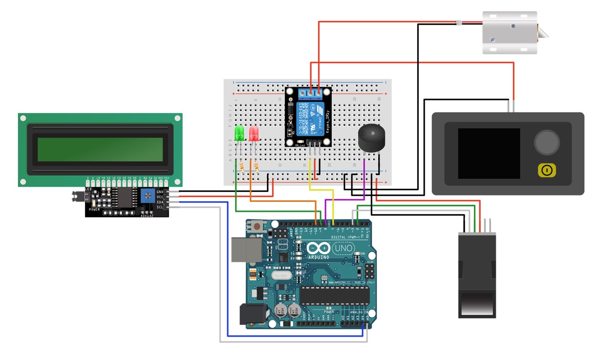

# 🔐 Arduino Fingerprint Sensor & Solenoid Lock with LCD

An Arduino-based biometric access control system using a fingerprint sensor, relay-driven solenoid lock, LCD display, LEDs, and buzzer.  
When a recognized fingerprint is presented, the solenoid is activated to unlock; otherwise the system denies access.  
Based on the project by Tishin on Arduino Project Hub. :contentReference[oaicite:0]{index=0}
Based on the project by Tishin on Arduino Project Hub:  [Arduino Project Hub – Arduino Fingerprint Sensor & Solenoid Lock w/ LCD](https://projecthub.arduino.cc/Tishin/arduino-fingerprint-sensor-solenoid-lock-wlcd-f01a40)

---

## 📌 Overview & Features

- **Objective**: Use fingerprint authentication to control a solenoid lock via Arduino.  
- **Display**: I²C LCD (1602) to show status messages. :contentReference[oaicite:1]{index=1}  
- **Indicators**: Green LED (access granted), Red LED (access denied)  
- **Audio feedback**: Buzzer provides sound on access granted/denied  
- **Relay & Solenoid**: A relay module controls the solenoid lock on successful authentication  
- **Custom animations**: Stop sign and arrow animations shown on LCD for feedback  
- **Pin setup & connections**: Defined in the source sketch and explained below :contentReference[oaicite:2]{index=2}  

---

## 🛠️ Hardware Requirements

| Component | Quantity | Purpose |
|------------|----------|---------|
| Arduino Uno (or compatible) | 1 | Main microcontroller |
| Fingerprint sensor (e.g. optical module) | 1 | Biometric input |
| I²C LCD (16×2) display | 1 | Display messages & animations |
| Relay module | 1 | To switch solenoid power |
| Solenoid lock | 1 | Locking mechanism |
| Buzzer / Piezo | 1 | Audible feedback |
| Green LED | 1 | Access-granted indicator |
| Red LED | 1 | Access-denied indicator |
| Resistor (330 Ω) | 1 (for LED) | Current limiting |
| Jumper wires / connectors | — | Connections |
| Power supply (5V, or as required by lock) | 1 | Powering components |

---

## 💻 Software & Libraries

- **Arduino IDE** (or compatible environment)  
- Required libraries:
  - `Wire` (for I²C communications)  
  - `LiquidCrystal_I2C` (for the LCD)  
  - `Adafruit_Fingerprint` (to interface with fingerprint sensor)  
  - `SoftwareSerial` (for communication with fingerprint module using RX/TX)  

---

## ⚡ Circuit / Wiring Diagram

Include a wiring image in your `images/` folder. Example:

```markdown
## ⚡ Circuit Diagram


